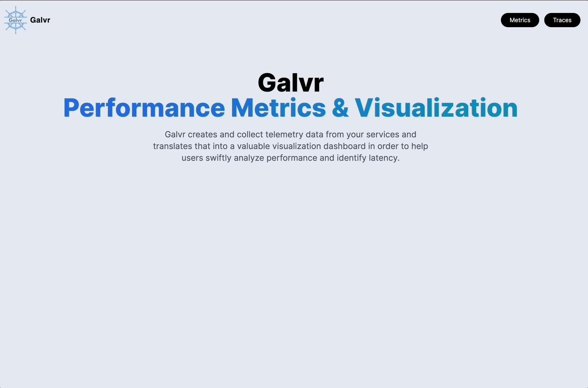

<div align="center">
  
</div>

### About

Galvr is a communication metric visualization dashboard for Kubernetes clusters. It is built on the [OpenTelemetry](https://opentelemetry.io/docs/what-is-opentelemetry/) observability framework and takes advantage of the metric aggregation processing done by OpenTelemtry instrumentation. It can work with any cluster using instrumentation that exports metrics with the [OTLP specification](https://opentelemetry.io/docs/specs/otlp/). Galvr is intended to be used alongside the [Jaeger](https://www.jaegertracing.io/) distributed tracing platform; in fact, it was created to be a sibling product meant for metrics instead of traces. Galvr consists of two services: a metric collector backend, and a metric visualization frontend. Currently, the two services must be used together, but future development may allow a la carte use.

Galvr is an unopinionated tool; as such, it works with Kubernetes clusters of any microservice configuration. It simply provides the user with a list of instrumented services and allows them to view whatever metrics they wish.


Galvr can also handle any metric it receives as long as the metric object follows OTLP specifications. This means it will visualize any histogram, sum, or gauge data type.  


### Quick Start

This guide assumes you have a Kubernetes cluster up and running.

##### Install cert-manager, which is required for the Otel (and Jaeger) operators:

```sh
kubectl apply -f https://github.com/cert-manager/cert-manager/releases/download/v1.11.0/cert-manager.yaml
```

##### Install the openTelemetry operator:

```sh
kubectl apply -f https://github.com/open-telemetry/opentelemetry-operator/releases/latest/download/opentelemetry-operator.yaml
```

##### Start the openTelemetry collector (you can use a different configuration file as long as it exports metric data to `metricendpoint:3000` with the OTLP/HTTP protocol):

```sh
kubectl apply -f https://github.com/oslabs-beta/Galvr/releases/download/latest/otelCol.yaml
```

##### If your services are not already instrumented, openTelemetry has a number of autoinstrumentation options (https://opentelemetry.io/docs/kubernetes/operator/automatic/). Autoinstrumentation for services written in Node.js can be added to your cluster with:

```sh
kubectl apply -f https://github.com/oslabs-beta/Galvr/releases/download/latest/otelNode.yaml
```

##### If you would like to use Jaeger for request tracing (recommended), replace the default openTelemetry collector with:

```sh
kubectl apply -f https://github.com/oslabs-beta/Galvr/releases/download/latest/otelCol-jaeger.yaml
```

##### and start up the Jaeger collector, as well as a basic all-in-one Jaeger instance:

```sh
kubectl create namespace observability
kubectl create -f https://github.com/jaegertracing/jaeger-operator/releases/download/v1.45.0/jaeger-operator.yaml -n observability
kubectl apply -f https://github.com/oslabs-beta/releases/download/latest/jaeger.yaml
```

##### For the Jaeger client to be available outside the cluster, you made need to port forward it:

```sh
kubectl port-forward services/jaeger-query 16686:16686
```

##### Finally, start Galvr! The client will be available at local port 30003.

```sh
kubectl apply -f https://github.com/oslabs-beta/Galvr/releases/download/latest/galvr.yml
```

### Demo

If you do not have already have a microservice application with which to test Galvr but would like to, we encourage you to try it with the OpenTelemetry Demo application. Instructions for setup can be found in the [demo/otel](./demo/otel/README.md) folder.

### License

Distributed under the MIT License. See `LICENSE.txt` for more information.

### Authors

**Daniel Jaworski** [GitHub](https://github.com/Djaworski1) | [LinkedIn](https://www.linkedin.com/in/jaworskidaniel/)  
**Sam Blackburn** [GitHub](https://github.com/samrblackburn) | [LinkedIn](https://www.linkedin.com/in/samrblackburn/)  
**Sharon Chen** [GitHub](https://github.com/sc1272) | [LinkedIn](https://www.linkedin.com/in/sharonjchen/)  
**Yi Sun** [GitHub](https://github.com/YiSun88) | [LinkedIn](https://www.linkedin.com/in/yi-sun-swe/)
